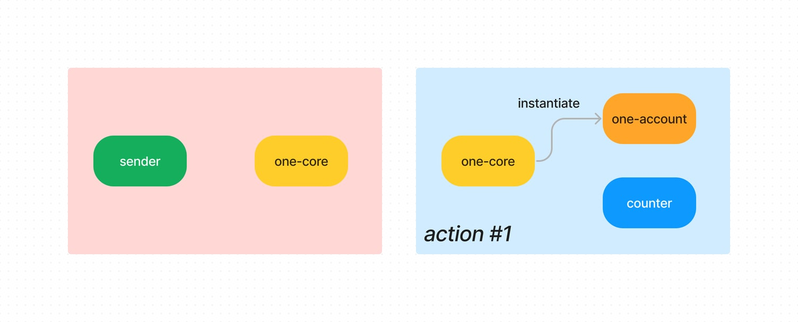
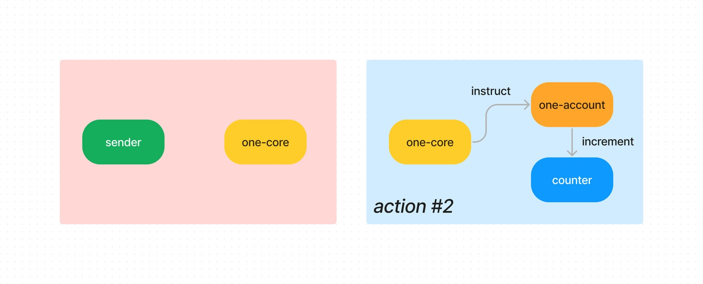
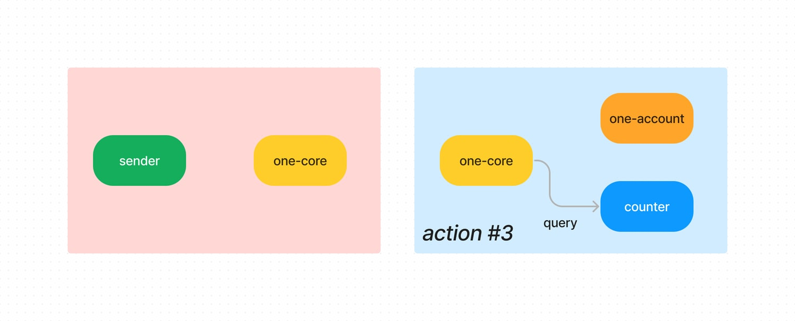
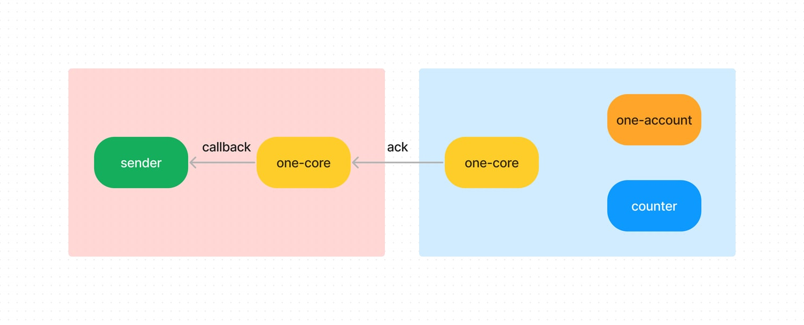

# Introduction to ICS-999

Let's use an example to illustrate how ICS-999 works.

[Counter](../contracts/mocks/counter/) is a smart contract on the host chain. It saves a single integer number in its store, initialized to 0 upon instantiation. Anyone can send the following ExecuteMsg to increase the number by 1:

```json
{
  "increment": {}
}
```

or query the number by sending the following QueryMsg:

```json
{
  "number": {}
}
```

[Sender](../contracts/mocks/sender/) is a contract on the controller chain. It wants to:

- own an account on the host chain
- instruct that account to execute counter contract to increment the number
- finally, query what the number is

To do this, sender invokes the [one-core](../contracts/core/) contract with the following ExecuteMsg, which includes a list of **actions** to execute, which chain these actions are to be executed on, and whether to request a callback once done:

```javascript
{
  "act": {
    "connection_id": "connection-0",
    "actions": [
      {
        "register_account": {}
      },
      {
        "execute": {
          "execute": {
            "contract_addr": "juno1..",        // counter contract address
            "msg": "eyJpbmNyZW1lbnQiOnt9fQ==", // base64 encoding of `{"increment":{}}`
            "funds": []
          }
        }
      },
      {
        "query": {
          "smart": {
            "contract_addr": "juno1..",        // counter contract address
            "msg": "eyJudW1iZXIiOnt9fQ=="      // base64 encoding of `{"number":{}}`
          }
        }
      }
    ],
    "callback": true,
  }
}
```

The core contract will compose a packet with the above content and send it to the corresponding core contract on the host chain, which will execute the actions one-by-one.


First, it instantiates a [one-account](../contracts/account/) contract, and records the sender as its controller:



Next, it instructs the account instance to execute the counter contract:



Finally, it queries the counter contract for it's latest number:



Now that all actions have been handled, the host core contract will compose a **packet acknowledgement** (ack) and return it to the controller core contract:



The ack includes the result for each of the actions that were executed, like this:

```javascript
{
  "results": [
    {
      "register_account": {
        "address": "juno1.."  // address of the account that was registered
      }
    },
    {
      "execute": {
        "data": ".."       // data returned by the counter contract, if any
      }
    },
    {
      "query": {
        "response": "eyJudW1iZXIiOjF9"  // base64 encoding of `{"number":1}`
      }
    }
  ]
}
```

Since in this example the sender has requested a callback, the controller core contract will invoke the sender contract with the following ExecuteMsg:

```javascript
{
  "packet_callback": {
    "channel_id": "channel-0",
    "sequence": 1,
    "ack": {
      "results": [
        // the results as shown above...
      ]
    }
  }
}
```

If any of the actions had unfortunately failed, the entire queue of actions are considered failed together, and no state change effected by these actions (even the successful ones) will be committed. The sender will get a callback that look like this:

```json
{
  "packet_callback": {
    "channel_id": "channel-0",
    "sequence": 1,
    "ack": {
      "error": "codespace: wasm, code: 5"
    }
  }
}
```

If the packet had timed out, the callback will look like:

```json
{
  "packet_callback": {
    "channel_id": "channel-0",
    "sequence": 1,
    "ack": null
  }
}
```

The sender contract can handle the callback based on the ack received. For example, in the case of a timeout, it can do a retry.
